# Deep Learning-Based Automatic Modulation Recognition Under Different SISO Channel Conditions

- **Course project:** MYZ 307E
- **Topic:** Automatic Modulation Recognition (AMR) with deep learning under AWGN, Rayleigh, and Rician SISO channels
- **Team:** Batuhan Gedik, Erkam Tug, Eren Soker, Muhammet Anil Gulaz

---

## Abstract

Automatic Modulation Recognition (AMR) is an important task in cognitive radio and wireless signal intelligence because a receiver often needs to identify the modulation format of an unknown signal before demodulation. Most benchmark AMR experiments are performed under additive white Gaussian noise (AWGN), while practical SISO links also experience multipath fading and low-SNR degradation.

This project reproduces AMR baselines on the RadioML 2016.10a dataset and extends the evaluation to more realistic SISO channel conditions. Two deep learning architectures, **MCLDNN** and **PET-CGDNN**, are evaluated on AWGN, Rayleigh fading, and Rician fading with K=3 and K=10. The project includes TensorFlow 2.x implementations, synthetic fading dataset generation, SNR-wise accuracy analysis, F1-macro and MCC metrics, result plots, and a presentation-ready visual report.

**Index Terms:** automatic modulation recognition, deep learning, SISO channel, Rayleigh fading, Rician fading, RadioML 2016.10a, MCLDNN, PET-CGDNN, low SNR.

---

## I. Project Motivation

The engineering problem is to classify digital and analog modulation types from short IQ signal snapshots when the received signal is corrupted by noise and channel fading. In real communication systems, the channel is not only AWGN. Multipath propagation can distort amplitude and phase, which reduces the reliability of models trained only on clean benchmark assumptions.

The project therefore asks a focused question:

> How robust are deep-learning-based AMR models when the same RadioML modulation task is evaluated under AWGN, Rayleigh fading, and Rician fading SISO channel conditions?

The main contribution is not just training a classifier, but building an experimental pipeline that makes the effect of channel conditions visible through SNR-wise curves, model comparisons, and channel-specific robustness summaries.

---

## II. Main Contributions

- Reproduced the RadioML 2016.10a AWGN baseline workflow with TensorFlow 2.x compatible code.
- Kept two representative AMR architectures from the benchmark family: MCLDNN and PET-CGDNN.
- Added SISO fading simulation utilities for Rayleigh and Rician channels.
- Generated faded dataset variants with the same label and SNR structure as RadioML 2016.10a.
- Evaluated three training strategies: AWGN baseline, training from scratch on faded data, and fine-tuning AWGN-pretrained models on faded data.
- Extended evaluation beyond accuracy with F1-macro and Matthews correlation coefficient (MCC).
- Committed paper-ready result figures and CSV summary tables under `results/plots/`.

---

## III. System Overview

The pipeline starts from the original RadioML 2016.10a IQ dictionary, applies controlled channel transformations, trains or adapts AMR models, and evaluates each model across SNR levels.

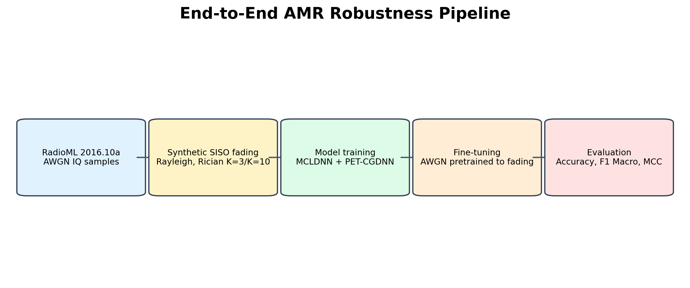

The project contribution is positioned as an extension of the original benchmark: the baseline AWGN task is retained, while fading-channel stress tests and richer metrics are added.

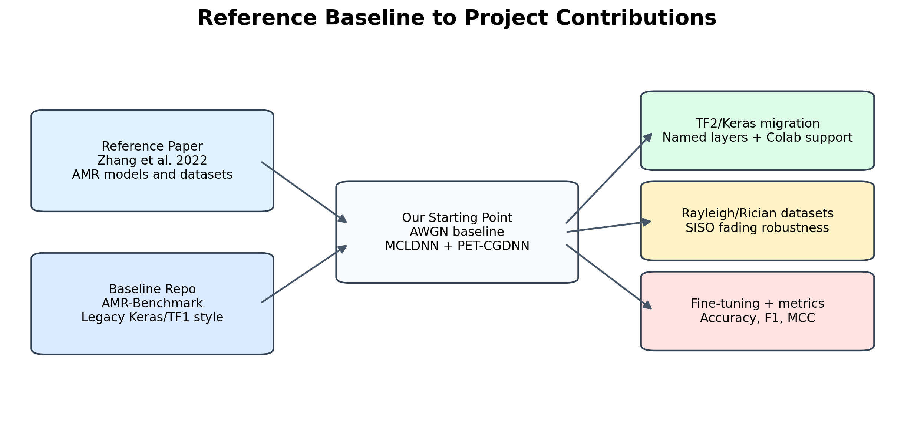

---

## IV. Dataset and Experimental Conditions

The dataset is **RadioML 2016.10a**, a widely used AMR benchmark generated with GNU Radio.

| Property | Value |
|---|---:|
| Dataset | RadioML 2016.10a |
| Total examples | 220,000 |
| Modulation classes | 11 |
| SNR range | -20 dB to +18 dB, step 2 dB |
| Samples per modulation/SNR pair | 1,000 |
| IQ tensor format | 2 x 128 |
| Train/validation/test split | 60% / 20% / 20% per modulation/SNR pair |
| Train examples | 132,000 |
| Validation examples | 44,000 |
| Test examples | 44,000 |

The 11 modulation classes are:

`8PSK`, `AM-DSB`, `AM-SSB`, `BPSK`, `CPFSK`, `GFSK`, `PAM4`, `QAM16`, `QAM64`, `QPSK`, `WBFM`.

The committed dataset map summarizes how the AWGN source dataset is expanded into fading-channel variants while preserving the same task structure.

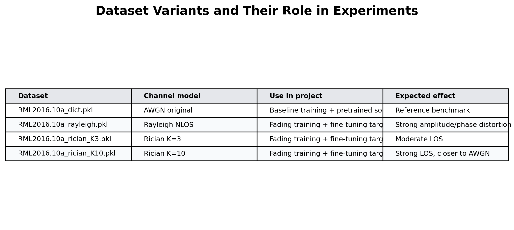

The raw dataset file is not tracked in Git because of size. Place it at:

```text
data/RML2016.10a_dict.pkl
```

For Google Colab runs, the notebooks expect:

```text
/content/drive/MyDrive/AMR-Project/RML2016.10a_dict.pkl
```

---

## V. Channel Modeling

The original RadioML 2016.10a benchmark is treated as the AWGN baseline. This project adds flat SISO fading effects through `src/utils/channels.py`.

**Rayleigh fading** models a no-line-of-sight channel:

```text
h ~ CN(0, 1)
y = h x
```

**Rician fading** models a channel with a deterministic line-of-sight component and a scattered component:

```text
h = sqrt(K / (K + 1)) + sqrt(1 / (K + 1)) h_nlos
y = h x
```

The experiments use:

| Channel | Interpretation |
|---|---|
| AWGN | Original RadioML condition |
| Rayleigh | Strong multipath, no dominant LOS path |
| Rician K=3 | Moderate LOS component |
| Rician K=10 | Stronger LOS component |

The implementation supports deterministic seeds and optional power normalization. Faded signals are returned in the original `(N, 2, 128)` IQ tensor format, so the same model loaders and training scripts can be reused.

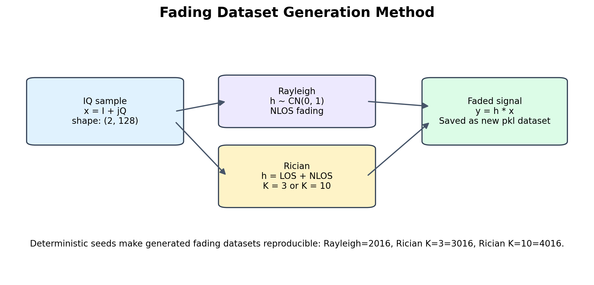

The constellation examples below show how the channel changes the visible IQ distribution before classification.

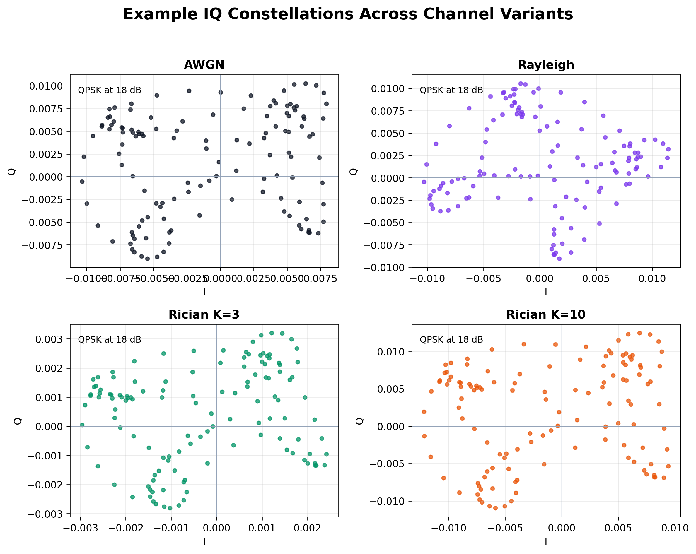

---

## VI. Deep Learning Models

Two AMR models are implemented in TensorFlow 2.x / `tf.keras`.

| Model | Source idea | Main structure | File |
|---|---|---|---|
| MCLDNN | Multi-channel spatiotemporal AMR | Conv1D/Conv2D branches for I/Q features, fusion, two LSTM layers, dense classifier | `src/models/mcldnn.py` |
| PET-CGDNN | Parameter estimation and transformation for AMR | Learnable phase estimation, IQ transformation, Conv2D feature extraction, GRU classifier | `src/models/petcgdnn.py` |

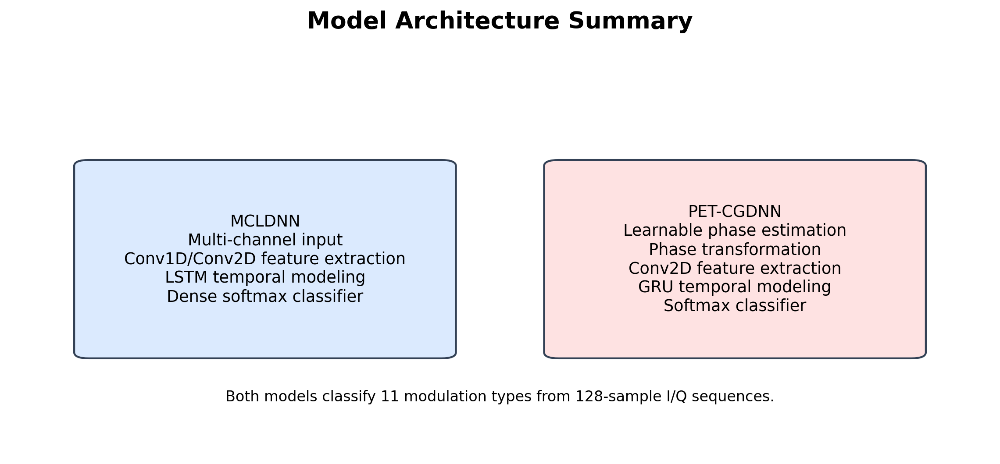

Both models classify the same 11 modulation classes and use categorical cross-entropy with Adam optimization in the training notebooks.

---

## VII. Experimental Protocol

The experiments are organized into three strategies.

| Strategy | Description |
|---|---|
| `baseline_awgn` | Train and evaluate on AWGN RadioML data. |
| `fading_trained` | Train from scratch on generated Rayleigh/Rician datasets. |
| `fine_tuned` | Start from AWGN-pretrained weights and adapt to faded datasets. |

Evaluation is performed per SNR level using:

- Overall classification accuracy
- Low-SNR accuracy, averaged over `SNR <= 0 dB`
- High-SNR accuracy, averaged over `SNR >= 0 dB`
- Accuracy at `+18 dB`
- Maximum SNR-wise accuracy
- F1-macro where available
- Matthews correlation coefficient (MCC) where available
- Confusion matrices and comparison plots

The training/evaluation design is summarized below.

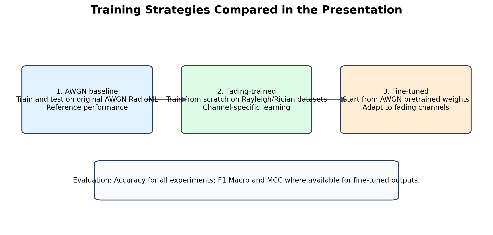

---

## VIII. Results

The table below is copied from the committed summary file:

```text
results/plots/table_02_summary_metrics.csv
```

| Strategy | Model | Channel | Mean Acc. (%) | Low-SNR Acc. (%) | High-SNR Acc. (%) | Acc. @ +18 dB (%) | Max Acc. (%) | SNR at Max | Mean F1 (%) | Mean MCC (%) |
|---|---|---|---:|---:|---:|---:|---:|---:|---:|---:|
| baseline_awgn | MCLDNN | AWGN | 61.27 | 36.97 | 90.53 | 91.23 | 91.86 | 8 | NA | NA |
| baseline_awgn | PET-CGDNN | AWGN | 60.75 | 36.43 | 90.03 | 90.68 | 91.27 | 12 | NA | NA |
| fading_trained | MCLDNN | Rayleigh | 60.69 | 36.50 | 89.94 | 90.59 | 90.73 | 8 | NA | NA |
| fading_trained | PET-CGDNN | Rayleigh | 60.64 | 35.32 | 91.10 | 92.27 | 92.55 | 12 | NA | NA |
| fading_trained | MCLDNN | Rician K=3 | 57.67 | 35.58 | 84.46 | 84.82 | 85.27 | 8 | NA | NA |
| fading_trained | PET-CGDNN | Rician K=3 | 60.38 | 35.83 | 89.90 | 91.00 | 91.18 | 10 | NA | NA |
| fading_trained | MCLDNN | Rician K=10 | 61.33 | 37.05 | 90.73 | 90.77 | 92.05 | 4 | NA | NA |
| fading_trained | PET-CGDNN | Rician K=10 | 57.55 | 35.83 | 83.66 | 83.50 | 85.05 | 8 | NA | NA |
| fine_tuned | MCLDNN | Rayleigh | 60.40 | 35.93 | 89.94 | 90.73 | 90.95 | 10 | 58.08 | 57.08 |
| fine_tuned | PET-CGDNN | Rayleigh | 58.78 | 34.62 | 87.87 | 88.55 | 89.18 | 8 | 56.68 | 55.18 |
| fine_tuned | MCLDNN | Rician K=3 | 60.78 | 36.55 | 89.93 | 90.64 | 91.32 | 8 | 58.65 | 57.50 |
| fine_tuned | PET-CGDNN | Rician K=3 | 59.84 | 35.55 | 89.05 | 89.64 | 90.82 | 10 | 57.78 | 56.41 |
| fine_tuned | MCLDNN | Rician K=10 | 60.94 | 36.65 | 90.17 | 91.23 | 91.45 | 8 | 58.86 | 57.71 |
| fine_tuned | PET-CGDNN | Rician K=10 | 60.40 | 36.29 | 89.40 | 89.73 | 91.00 | 8 | 58.35 | 57.06 |

### Key Observations

- The AWGN baselines reach about **91-92% maximum accuracy** at high SNR, matching the expected behavior of RadioML-style AMR tasks.
- Rayleigh fading does not collapse performance when models are trained or adapted under the same channel condition; PET-CGDNN reaches **92.55% maximum accuracy** on Rayleigh in the faded-training experiment.
- Rician K=3 is one of the harder fading cases for MCLDNN when trained from scratch, with a mean accuracy of **57.67%**.
- MCLDNN gives the strongest fine-tuned averages across the three faded channels, with mean F1-macro near **58-59%** and mean MCC near **57-58%**.
- Low-SNR remains the dominant failure region. Across experiments, low-SNR averages stay around **34-37%**, which is much lower than high-SNR averages near **88-91%**.

### Accuracy-vs-SNR Curves

The following plots show the central performance comparison across SNR values.

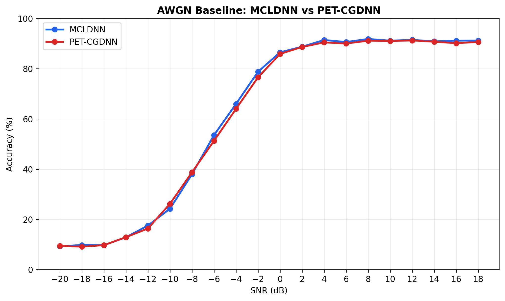

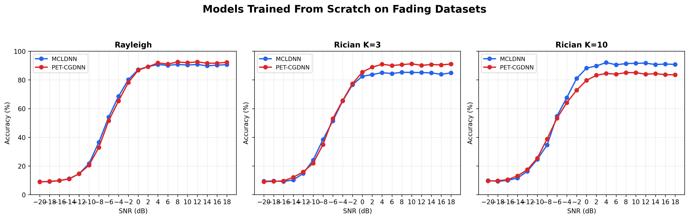

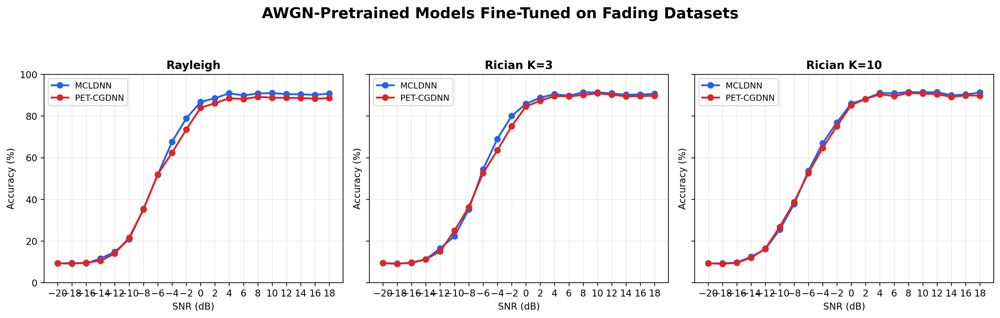

### Fine-Tuning, F1, and MCC

Accuracy alone can hide class imbalance effects and confusion behavior. Fine-tuned runs therefore include F1-macro and MCC summaries.

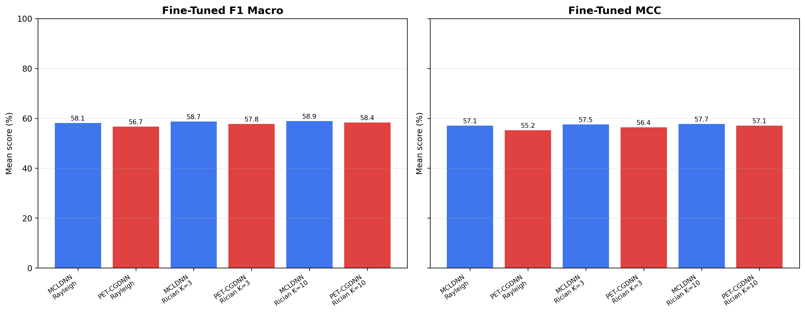

The three-way comparisons below separate AWGN baseline behavior, pre-fine-tuning fading performance, and post-fine-tuning fading performance.

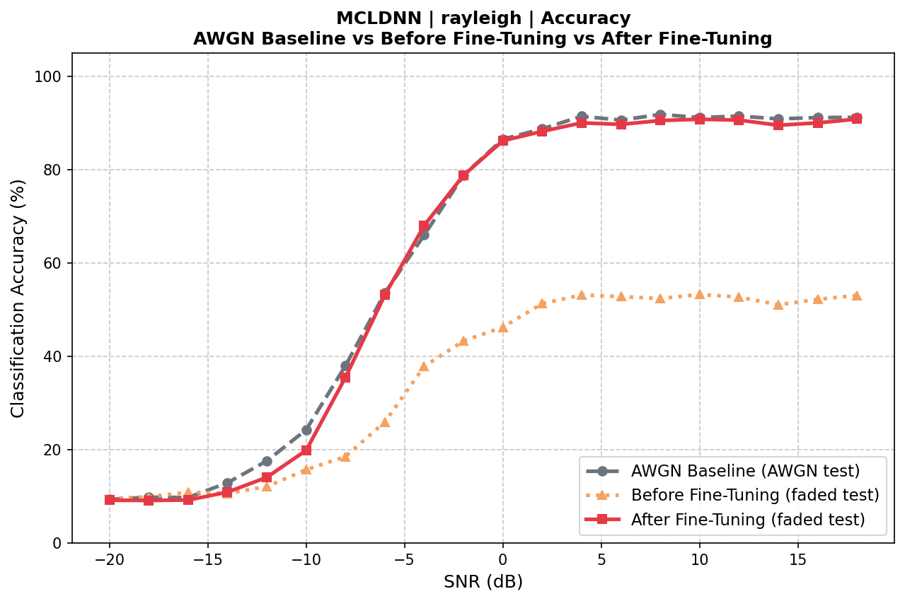

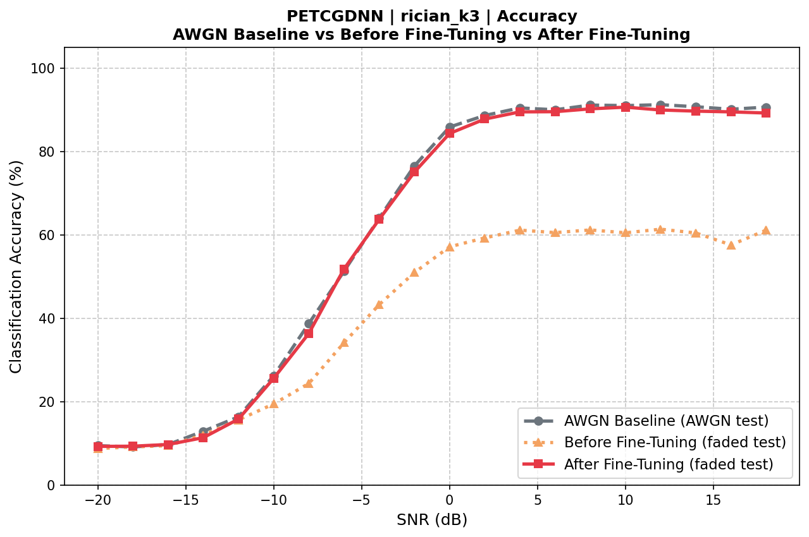

### Low-SNR Robustness

Low SNR is the most important region for this project because the original proposal targeted practical recognition under difficult channel conditions.

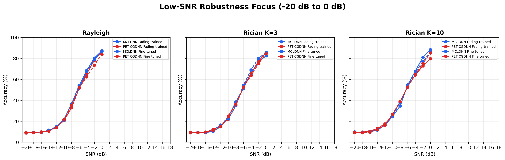

### Model and Channel Heatmap

The heatmap provides a compact view of which model/channel combinations are strongest on average.

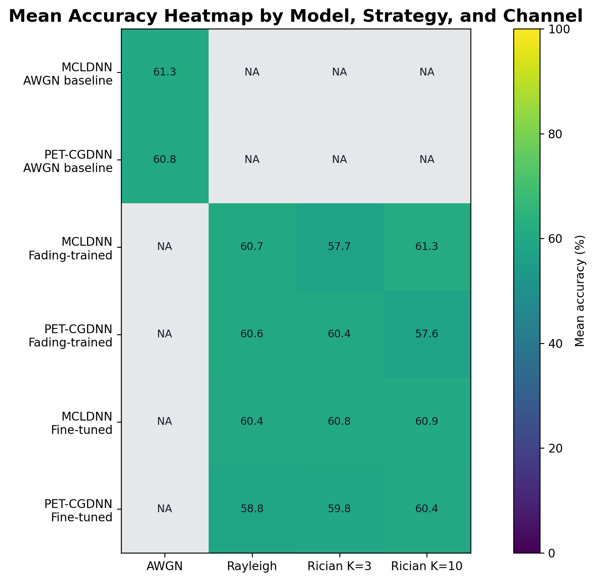

### Best Model Summary

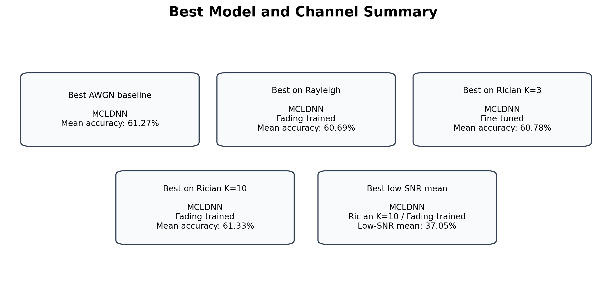

More figures are available in:

```text
results/plots/
```

---

## IX. Reproducibility

### Environment

The project is optimized for Google Colab with GPU support, but the source modules can also be used locally with Python 3.8+.

```bash
git clone https://github.com/erigami-sl/AMR-UnderDifferentNoises-DL.git
cd AMR-UnderDifferentNoises-DL
pip install -r requirements.txt
```

Main dependencies:

```text
tensorflow>=2.10.0
numpy>=1.21.0
matplotlib>=3.5.0
scikit-learn>=1.0.0
h5py>=3.0.0
commpy>=0.7.0
```

### Dataset Setup

Download `RML2016.10a_dict.pkl` and place it in:

```text
data/RML2016.10a_dict.pkl
```

The dataset is not committed because it is too large for normal GitHub tracking.

### Notebook Execution Order

| Step | Notebook | Purpose |
|---:|---|---|
| 1 | `notebooks/01_baseline_mcldnn.ipynb` | Train/evaluate MCLDNN AWGN baseline. |
| 2 | `notebooks/02_baseline_petcgdnn.ipynb` | Train/evaluate PET-CGDNN AWGN baseline. |
| 3 | `notebooks/03_verify_channels.ipynb` | Verify fading implementation statistically and visually. |
| 4 | `notebooks/04_generate_faded_datasets.ipynb` | Generate Rayleigh, Rician K=3, and Rician K=10 datasets. |
| 5 | `notebooks/05_visualize_fading_effects.ipynb` | Visualize IQ and constellation effects of fading. |
| 6 | `notebooks/06_train_petcgdnn_fading.ipynb` | Train PET-CGDNN on faded datasets. |
| 7 | `notebooks/07_train_mcldnn_fading.ipynb` | Train MCLDNN on faded datasets. |
| 8 | `notebooks/08_finetuning_awgn_on_faded.ipynb` | Fine-tune AWGN-pretrained models on fading channels. |
| 9 | `notebooks/08b_compute_awgn_f1_mcc.ipynb` | Compute F1/MCC artifacts for AWGN checkpoints when needed. |
| 10 | `notebooks/09_results_analysis_and_comparison.ipynb` | Generate paper/presentation-ready summary figures. |
| 11 | `notebooks/09b_results_analysis_and_comparison.ipynb` | Generate additional comparison plots from fine-tuning results. |

The committed CSV inventory lists which experiment artifacts were found during result generation:

```text
results/plots/table_01_experiment_inventory.csv
```

---

## X. Repository Structure

```text
AMR-UnderDifferentNoises-DL/
|-- README.md
|-- requirements.txt
|-- MYZ 307E Project Proposal.txt
|-- AMR_SISO_Channel_Presentation.pptx
|-- data/
|   |-- README.md
|-- notebooks/
|   |-- 01_baseline_mcldnn.ipynb
|   |-- 02_baseline_petcgdnn.ipynb
|   |-- 03_verify_channels.ipynb
|   |-- 04_generate_faded_datasets.ipynb
|   |-- 05_visualize_fading_effects.ipynb
|   |-- 06_train_petcgdnn_fading.ipynb
|   |-- 07_train_mcldnn_fading.ipynb
|   |-- 08_finetuning_awgn_on_faded.ipynb
|   |-- 08b_compute_awgn_f1_mcc.ipynb
|   |-- 09_results_analysis_and_comparison.ipynb
|   |-- 09b_results_analysis_and_comparison.ipynb
|-- results/
|   |-- plots/
|       |-- table_01_experiment_inventory.csv
|       |-- table_02_summary_metrics.csv
|       |-- fig_01_reference_and_contribution_map.png
|       |-- fig_02_project_pipeline.png
|       |-- ...
|-- src/
|   |-- config.py
|   |-- models/
|   |   |-- mcldnn.py
|   |   |-- petcgdnn.py
|   |-- utils/
|       |-- channels.py
|       |-- dataset.py
|       |-- metrics.py
```

---

## XI. Discussion and Limitations

The results support the central project claim: AMR evaluation becomes more informative when channel conditions are varied beyond AWGN. However, several limitations remain.

- The fading models are synthetic flat SISO channels, not measured over-the-air captures.
- The original RadioML labels and SNR structure are preserved, so the experiment measures controlled robustness rather than deployment performance.
- The low-SNR region remains difficult for both architectures.
- Some historical baseline artifacts only contain accuracy files; fine-tuned and recomputed runs provide F1/MCC artifacts.
- Model weights and raw generated datasets are not committed because of size, so full reproduction requires running the notebooks or using the team Drive artifacts.

---

## XII. Conclusion

This repository extends a standard AMR benchmark into a channel-aware study. By combining RadioML 2016.10a, MCLDNN, PET-CGDNN, Rayleigh fading, Rician fading, SNR-wise evaluation, and committed visual summaries, the project provides a reproducible basis for comparing AMR robustness under different SISO channel conditions.

The most important practical takeaway is that high-SNR AMR performance can remain strong under controlled fading-aware training, but low-SNR recognition remains the main bottleneck and should be the focus of future work.

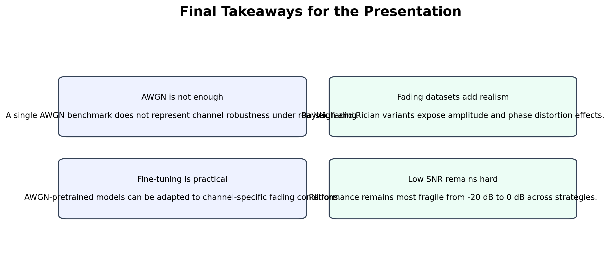

---

## References

[1] F. Zhang, C. Luo, J. Xu, Y. Luo, and F. Zheng, "Deep learning based automatic modulation recognition: Models, datasets, and challenges," *Digital Signal Processing*, vol. 129, 2022, Art. no. 103650. DOI: 10.1016/j.dsp.2022.103650.

[2] T. J. O'Shea, T. Roy, and T. C. Clancy, "Over-the-Air Deep Learning Based Radio Signal Classification," *IEEE Journal of Selected Topics in Signal Processing*, vol. 12, no. 1, pp. 168-179, Feb. 2018. DOI: 10.1109/JSTSP.2018.2797022.

[3] J. Xu, C. Luo, G. Parr, and Y. Luo, "A Spatiotemporal Multi-Channel Learning Framework for Automatic Modulation Recognition," *IEEE Wireless Communications Letters*, vol. 9, no. 10, pp. 1629-1632, 2020.

[4] F. Zhang, C. Luo, J. Xu, and Y. Luo, "An Efficient Deep Learning Model for Automatic Modulation Recognition Based on Parameter Estimation and Transformation," *IEEE Communications Letters*, vol. 25, no. 10, pp. 3287-3291, 2021.

[5] R. Zhang, "AMR-Benchmark," GitHub repository. Available: https://github.com/Richardzhangxx/AMR-Benchmark.
